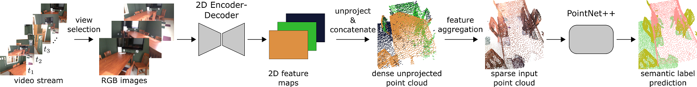

# MVPNet: Multi-view PointNet for 3D Scene Understanding


If you find our work useful, please cite our [paper](https://arxiv.org/abs/1909.13603):
```
@inproceedings{jaritz2019multi,
	title={Multi-view PointNet for 3D Scene Understanding},
	author={Jaritz, Maximilian and Gu, Jiayuan and Su, Hao},
	booktitle={ICCV Workshop 2019},
	year={2019}
}
```

## Pre-requisites
- Python 3.6
- Pytorch 1.2.0
- CUDA 10.0 & CUDNN 7.6.4

All experiments can be run with a GPU with 11GB of RAM.

## Preparation
### Installation
It is recommended to create a (mini)conda environment:
```bash
cd <root of this repo>
conda env create --file environment.yml
conda activate mvpnet
export PYTHONPATH=$(pwd):$PYTHONPATH
```
Compile the module for PointNet++:
```bash
bash compile.sh
```

### ScanNet Dataset
In order to download the ScanNet data, you need to fill out an agreement.
You will then be provided with a download script.
Please refer to the github page for details:
```
https://github.com/ScanNet/ScanNet
```
Note that you need to make minor changes to the script to run it with python3 (use `import urllib.request` instead of
`urllib` and `input` instead of `raw_input`).

#### 3D data
The 3D data contains the point clouds and 3D segmentation labels which is sufficient if you only want to run the
PointNet2 baseline. However, for MVPNet with image fusion you also need to download the 2D data.
Download the 3D data using the script like follows:
```
python download-scannet.py -o <ScanNet root> --type _vh_clean_2.ply
python download-scannet.py -o <ScanNet root> --type _vh_clean_2.labels.ply
```
After the download, your folder should look like this:
```
<ScanNet root>/scans/<scan_id>                                     % scan id, e.g.: scene0000_00
<ScanNet root>/scans/<scan_id>/<scan_id>_vh_clean_2.ply            % 3D point cloud (whole scene)
<ScanNet root>/scans/<scan_id>/<scan_id>_vh_clean_2.labels.ply     % 3D semantic segmentation labels
```
There is also a `scans_test` directory which is only needed to submit the results to the benchmark server.

#### 2D data
Note that it takes a lot of time to download and extract the whole 2D data. It comprises all frames of the video streams.
Download the 2D data using the script like follows:
```
python download-scannet.py -o <ScanNet root> --type .sens
python download-scannet.py -o <ScanNet root> --type _2d-label.zip
```

After download, the `.sens` files (one per scene) need to be extracted to get the 2D frame information
(color, depth, intrinsic, pose).
For extraction, we need to use the official SensReader code from the ScanNet repo which is in Python 2. We suggest to
create an environment (e.g. `conda create --name py27 python=2.7 `) and use it to run our convenience script  using
multiprocessing for extraction (please change the data paths in the script accordingly):
```
# only for this script, use Python 2.7
python mvpnet/data/preprocess/extract_raw_data_scannet.py
```

After that, you need to unzip the 2D labels. You can use our convenience script (adapt paths):
```
python mvpnet/data/preprocess/unzip_2d_labels.py
```

After extraction, you should have the following 2D data in your data directory:
```
<ScanNet root>/scans/<scan_id>                                     % scan id, e.g.: scene0000_00 
<ScanNet root>/scans/<scan_id>/color/                              % RGB images
<ScanNet root>/scans/<scan_id>/depth/                              % depth images
<ScanNet root>/scans/<scan_id>/intrinsic/                          % camera intrinsics
<ScanNet root>/scans/<scan_id>/label/                              % 2D labels
<ScanNet root>/scans/<scan_id>/pose/                               % pose for each 2D frame
```

In order to save disk space and reduce data loading times, we resize all images to the target resolution of 160x120. 
Use the following script (adapt paths in the script):
```
python mvpnet/data/preprocess/resize_scannet_images.py
```

#### Build data cache
If you only want to run the PointNet2 baseline use the following script (adapt paths in the script):
```
python mvpnet/data/preprocess/preprocess.py -o <output dir> -s <split>
```
This dumps all the ply files (3D point clouds) into one pickle file for faster loading.

For MVPNet, we also need to compute the overlap of each RGBD frame with the whole scene point cloud.
You might want to copy the comparably lightweight 3D data, poses and intrinsics over to the directory with
the resized scans with the `--parents` option in order to use the downscaled data for preprocessing. 
```
cd <ScanNet root>/scans
cp --parents scene0*/*.ply <ScanNet root>/scans_resize_160x120/
cp -r --parents scene0*/intrinsic <ScanNet root>/scans_resize_160x120/
cp -r --parents scene0*/pose <ScanNet root>/scans_resize_160x120/
```
Run the preprocessing with the option `--rgbd` to also compute RGBD overlap, needed for MVPNet.
```
python mvpnet/data/preprocess/preprocess.py -o <output dir> -s <split> --rgbd
```

## Training
The scripts are supposed to be run from the root of the repo.
### MVPNet
Pre-train 2D networks on the 2D semantic segmentation task.
```bash
python mvpnet/train_2d.py --cfg configs/scannet/unet_resnet34.yaml
```
Train MVPNet
```bash
python mvpnet/train_mvpnet_3d.py --cfg configs/scannet/mvpnet_3d_unet_resnet34_pn2ssg.yaml
```

### 3D baselines (optional)
We include the code for PointNet++ baselines in chunk based and whole scene processing. You can train them with:
```bash
# chunk-based processing
python mvpnet/train_3d.py --cfg configs/scannet/3d_baselines/pn2ssg_chunk.yaml
# whole scene processing
python mvpnet/train_3d.py --cfg configs/scannet/3d_baselines/pn2ssg_scene.yaml
```

## Testing
After you have trained the networks, you can test as follows:

### MVPNet
2D networks on the 2D semantic segmentation task.
```bash
python mvpnet/test_2d.py --cfg configs/scannet/unet_resnet34.yaml
```
2D networks on the 3D semantic segmentation task. This uses depth maps to unproject the 2D result.
```bash
python mvpnet/test_2d_chunks.py --cfg configs/scannet/unet_resnet34.yaml
```
MVPNet on the 3D semantic segmentation task.
```bash
python mvpnet/test_mvpnet_3d.py --cfg configs/scannet/mvpnet_3d_unet_resnet34_pn2ssg.yaml  --num-views 5
```

### 3D baselines (optional)
```bash
# chunk-based processing
python mvpnet/test_3d_chunks.py --cfg configs/scannet/3d_baselines/pn2ssg_chunk.yaml
# whole scene processing
python mvpnet/test_3d_scene.py --cfg configs/scannet/3d_baselines/pn2ssg_scene.yaml
```

## Results
On the validation set, we obtain the following results:

| Method (config)  | mIoU on val set|
| ------------- | ------------- |
| 3D baseline (pn2ssg_chunk) | 58.14  |
| 2D to 3D projection baseline (unet_resnet34) | 61.22  |
| MVPNet (mvpnet_3d_unet_resnet34_pn2ssg) | 67.92  |

Note that results can slightly differ from training to training.

## License
The code is released under the MIT license.
Copyright (c) 2019